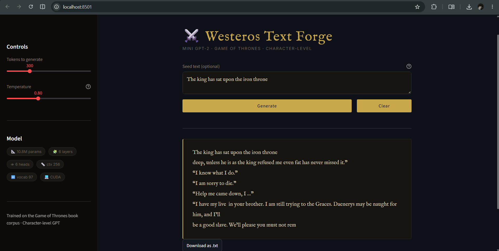

# smallGPT

A small GPT implementation in PyTorch trained on the Game of Thrones books.




I implemented this after watching Andrej Karpathy's [Let's Build GPT](https://www.youtube.com/watch?v=kCc8FmEb1nY) video. Basically just wanted to understand how these things work from scratch.

Trained it on GoT books. The output doesn't really mean anything but it kinda looks like the writing style.


## Model

```
Parameters      : ~10.65M
Embedding dim   : 384
Attention heads : 6
Layers          : 6
Context length  : 256
```

Character level tokenizer, so the vocab is just the ~97 unique characters in the books.


## Training

Trained on Kaggle using a T4 GPU (free). Takes around 65 mins for 5000 steps.

```
Dataset    : Game of Thrones books (~9.7M characters)
Optimizer  : AdamW
Batch size : 64
Steps      : 5000
```


## Running it

Open `gpt-small.ipynb` and run all cells. GPU recommended for training.

For the Streamlit app:

```bash
pip install -r requirements.txt
streamlit run app.py
```

You'll need `gpt_got.pth`, `hparams.json` and `tokenizer.json` in the same folder. The notebook has a save block at the end that generates these.

Live demo: [link](https://smallgpt-shadow-sama.streamlit.app)

---

Credit to Karpathy's [nanoGPT](https://github.com/karpathy/nanoGPT). Dataset from [Kaggle](https://www.kaggle.com/datasets/aniketdvd/game-of-thrones-books).